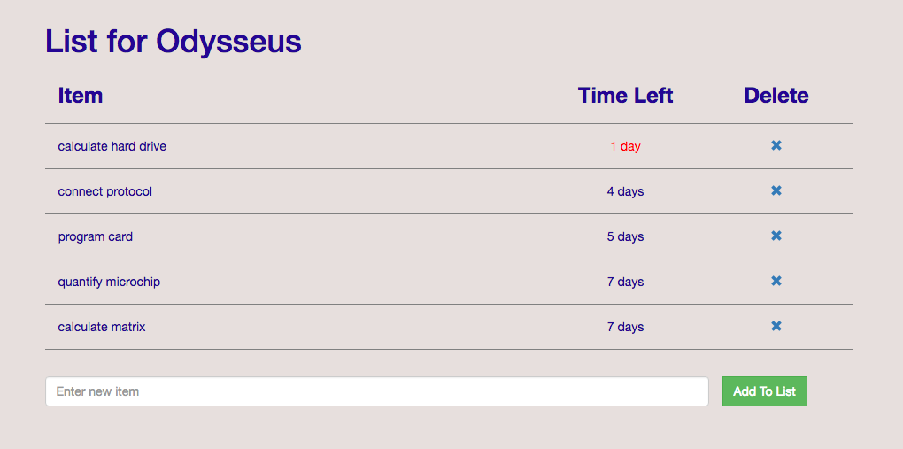

# Blocitoff

**A to-do list app using Ruby on Rails.**

### How It Works
* **Devise** gem for signing up and logging in
* **Faker** gem for seeding data
* **AJAX** to add and delete items
* **Rails `distance_of_time_in_words` method** to dynamically generate time remaining to complete item (if less than two days, time remaining turns red)
* **Custom rake task** to delete items more than seven days old
